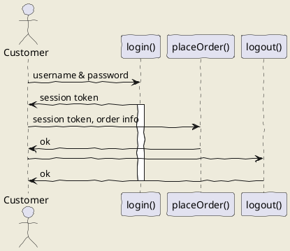

# SCCS_2020_1
Projeto da Disciplina de Sistemas de Conforto, Conveniência e Segurança - FATEC Santo André

Esses são os arquivos basea para a construção do projeto de um painel de instrumentos automotivo.

